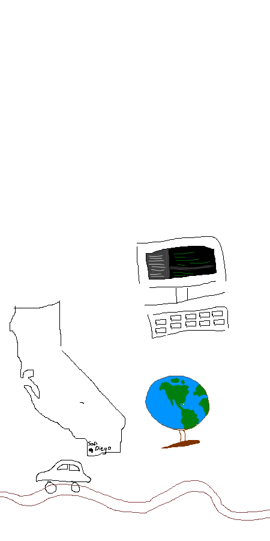

<h1 style="padding-top: 100px">Ian's Blog - Computer Science Principles</h1>
I'm Ian, a current 10th grader, and this blog will go through my journey in CSP - All the struggles, successes, and failures that I go through in this class.

Latest Weekly Log: [Week-1-Log](log/2023/08/21/Week-1.html)

### Hobbies/About Me
Where I spend my time when I'm not overloaded with the truckton of homework I get

Freeform image, about me: 

The above represents my interests, namely geography and computers, as well as a love for road trips. Please excuse the terrible drawing skills, drawing is not my strong suite.

##### Geography Links
One of my passions is learning various things about geography, as there are many, many places to explore.
- City knowledge test: [Cityquiz](https://cityquiz.io)
- City coverage on a map: [Hugequiz](https://hugequiz.com/quizzes)
- [Geoguessr](https://www.geoguessr.com/)
- Redraw the state borders to see the outcome of elections: [Redraw the States](https://kevinhayeswilson.com/redraw)

### Schedule

Click the buttons below to see my schedule for this first trimester.

<button class="button" type="button" onclick="alert('AP Physics C: Mechanics')">Period 1</button>
<button class="button" type="button" onclick="alert('AP Calculus AB')">Period 2</button>
<button class="button" type="button" onclick="alert('Honors Humanities 1')">Period 3</button>
<button class="button" type="button" onclick="alert('AP Chinese')">Period 4</button>
<button class="button" type="button" onclick="alert('AP Computer Science Principles')">Period 5</button>

